# Lab - Configure DHCPv6

###  Objectives:

+ Part 1: Build the Network and Configure Basic Device Settings
+ Part 2: Verify SLAAC address assignment from R1
+ Part 3: Configure and verify a Stateless DHCPv6 Server on R1
+ Part 4: Configure and verify a Stateful DHCPv6 Server on R1
+ Part 5: Configure and verify a DHCPv6 Relay on R2

### Topology:

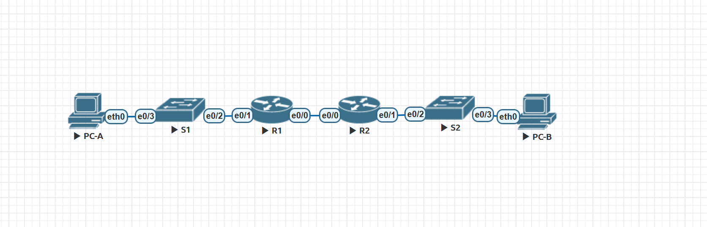

### Addressing Table:

<table>

<tr>
	<td>Устройство</td>
	<td>Интерфейс</td>
	<td>IPv6-адрес</td>
</tr>

<tr>
        <td rowspan="4">R1</td>
        <td rowspan="2">E0/0</td>
	 <td>2001:db8:acad:2::1/64</td>
</tr>

<tr>
	 <td>fe80::1</td>
</tr>

<tr>
        <td rowspan="2">E0/1</td>
	 <td>2001:db8:acad:1::1/64</td>
</tr>

<tr>
	 <td>fe80::1</td>
</tr>

<tr>
        <td rowspan="4">R2</td>
        <td rowspan="2">E0/0</td>
	 <td>2001:db8:acad:2::2/64</td>
</tr>

<tr>
	 <td>fe80::2</td>
</tr>

<tr>
        <td rowspan="2">E0/1</td>
	 <td>2001:db8:acad:3::1/64</td>
</tr>

<tr>
	 <td>fe80::1</td>
</tr>

<tr>
        <td>PC-A</td>
        <td>NIC</td>
	 <td>DHCP</td>
</tr>

<tr>
        <td>PC-B</td>
        <td>NIC</td>
	 <td>DHCP</td>
</tr>

</table>

### Домашнее задание:

Выполним базовую настройку коммутаторов

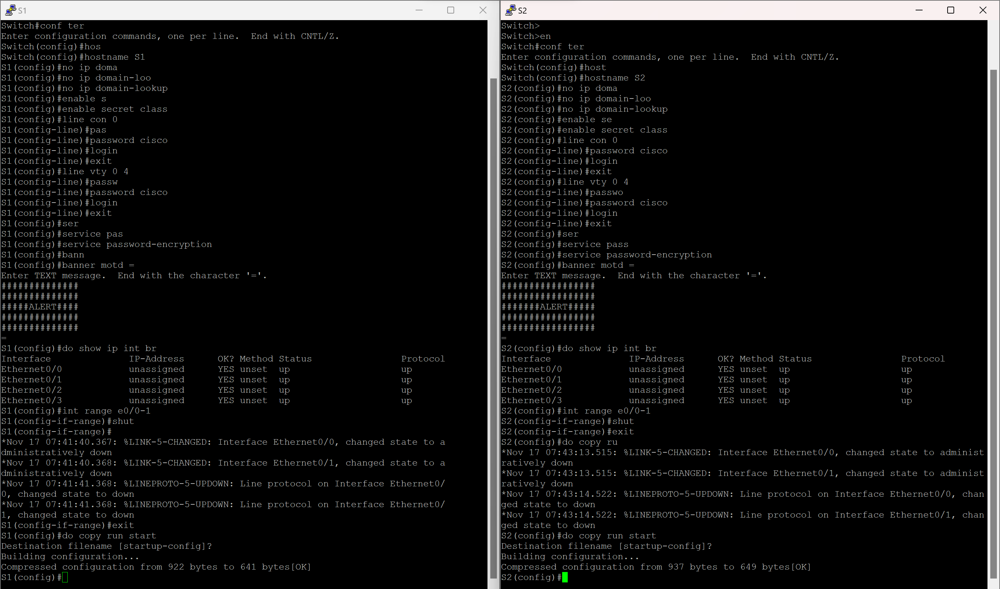

Выполним  базовую настройку маршрутизаторов

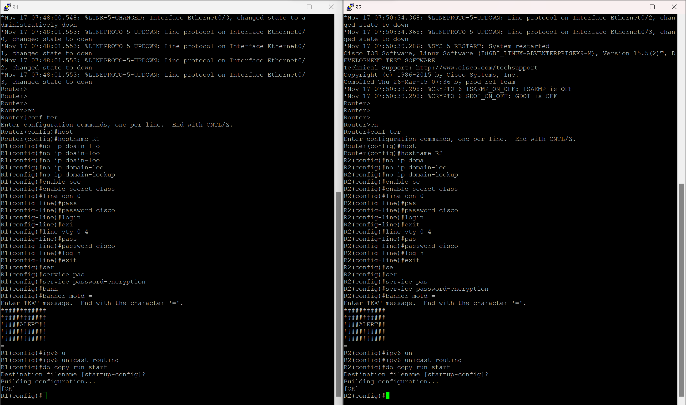

Настроим порты, статическую маршрутизацию и пропингуем их

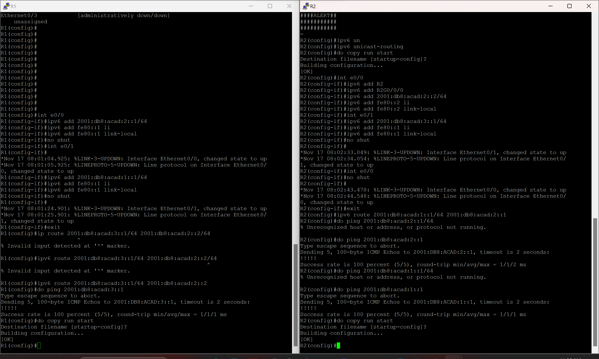

Получим адрес по SLAAC на PC-A

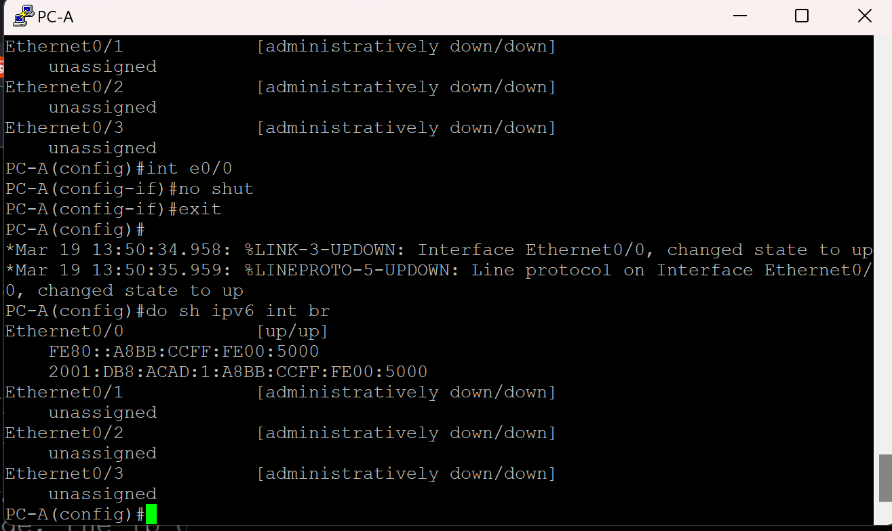

Создадим dchp пул, пропишем ему настройки, на интерфейсе e0/1 укажем в пакете RA флаг О на 1 и прикрепим к интерфейсу новый пул.

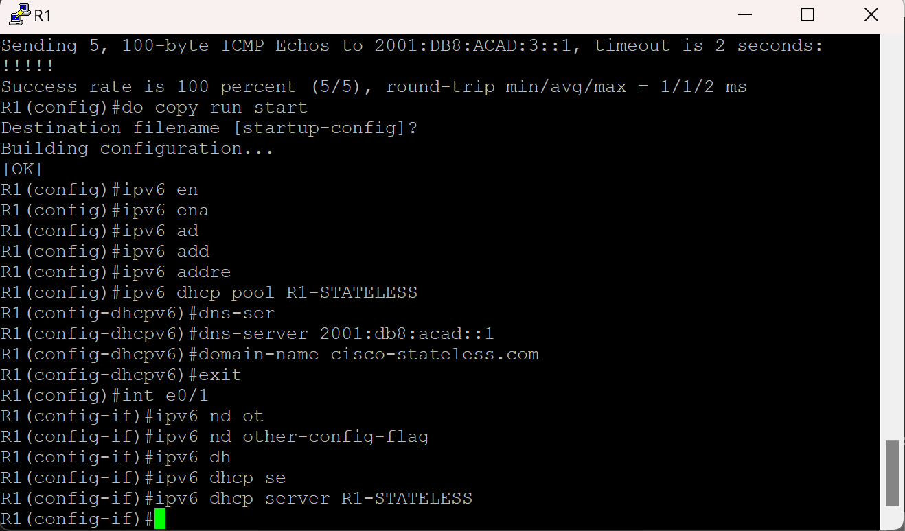

Я не знаю как проверить работоспособность SLAAC + DHCP тк мои образы не поддерживают это, поэтому просто пропингуем порт g0/0/1 на R2

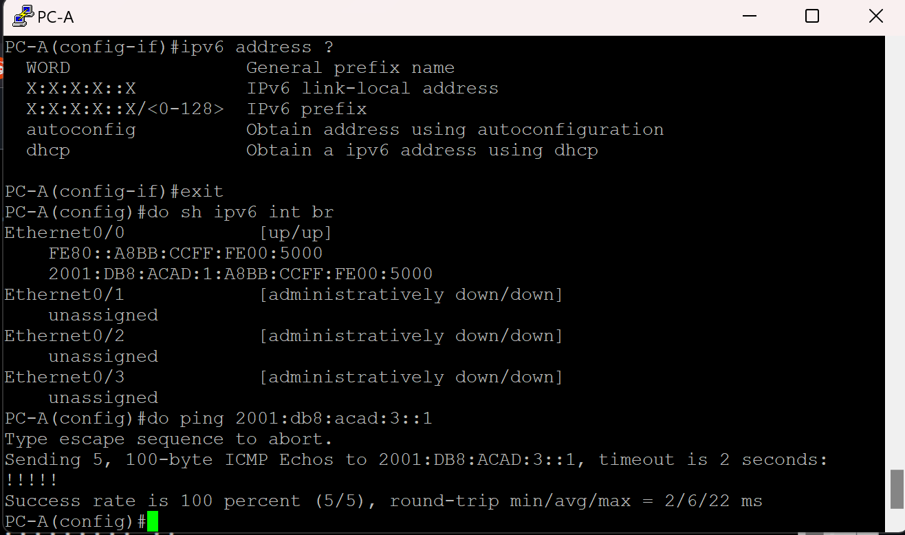

Создадим новый пул для сети за R2 g0/0/1 и сделаем его statefull

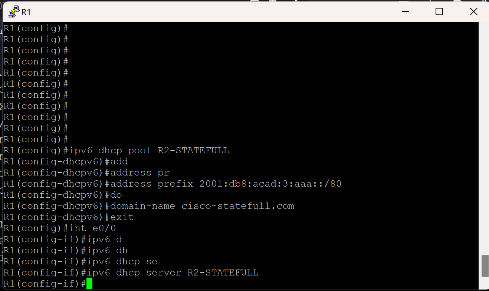

Проверим сетевые настройки PC-B и убедимся, что он их получает по SLAAC

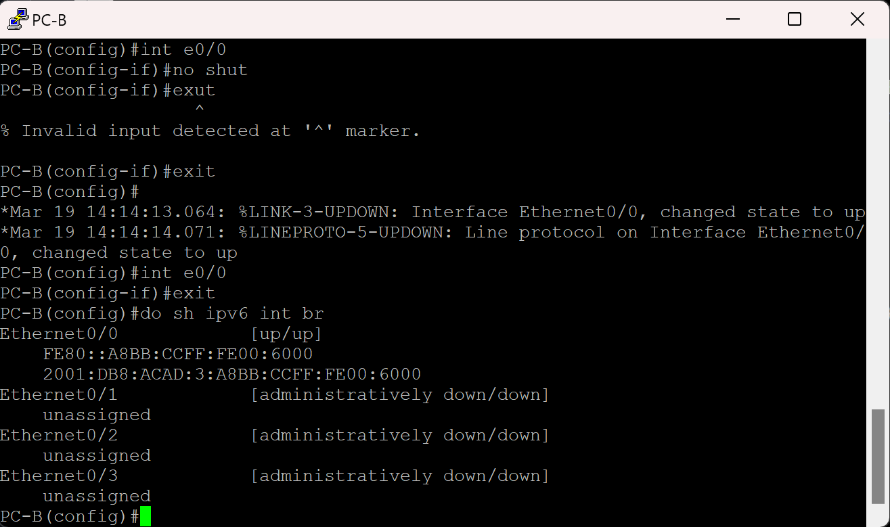

Включим М флаг и релей

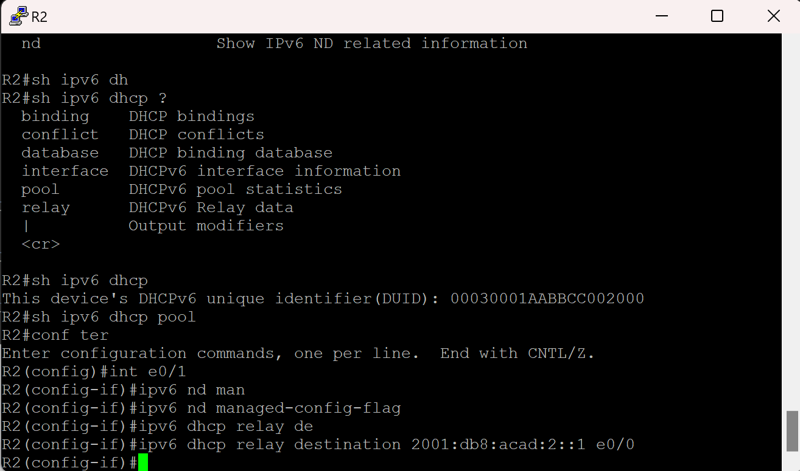

Проверим , что PC-B получает адрес по DHCP

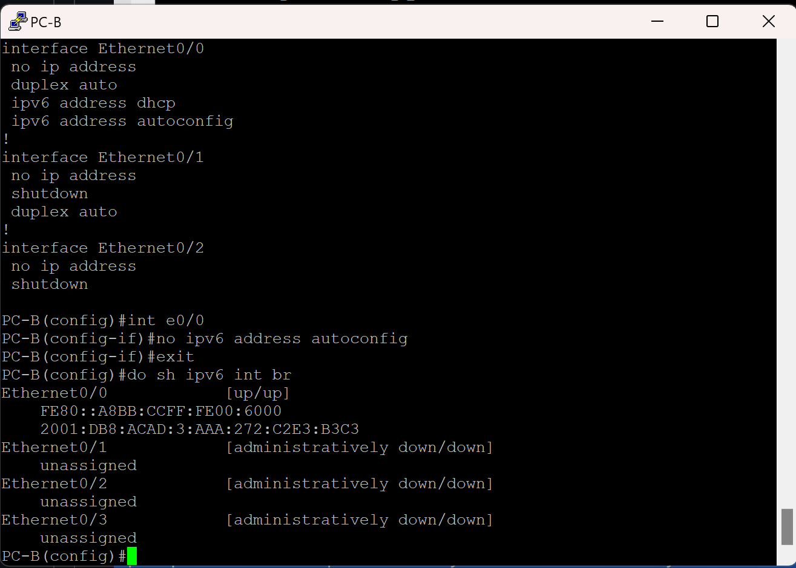

Пропингуем R1 e0/1 

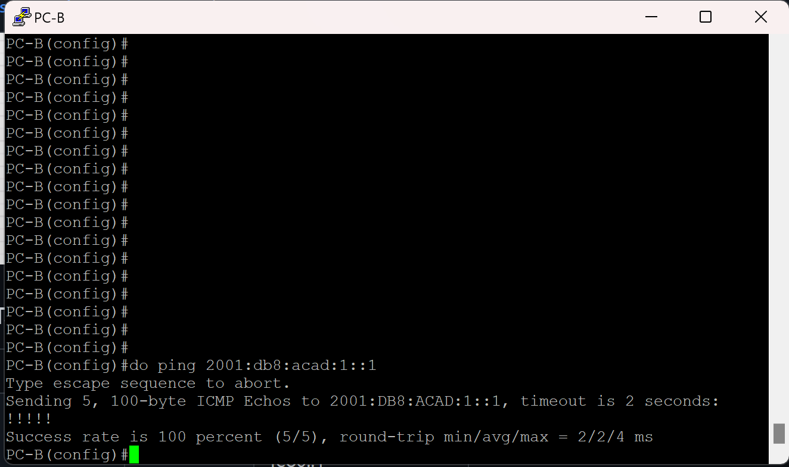