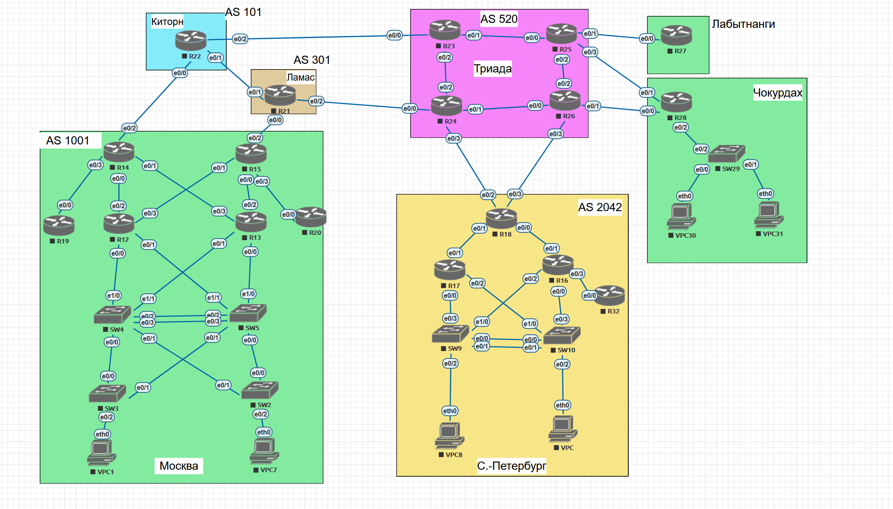
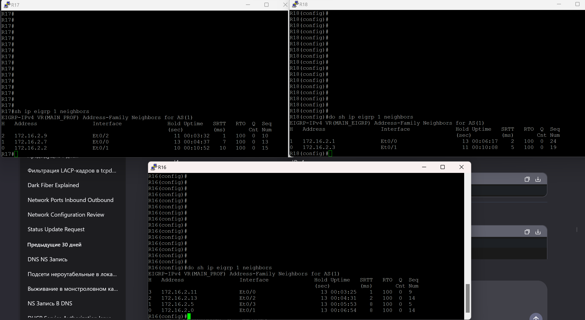
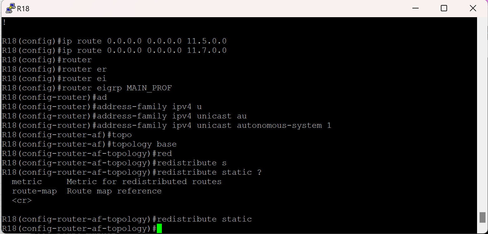
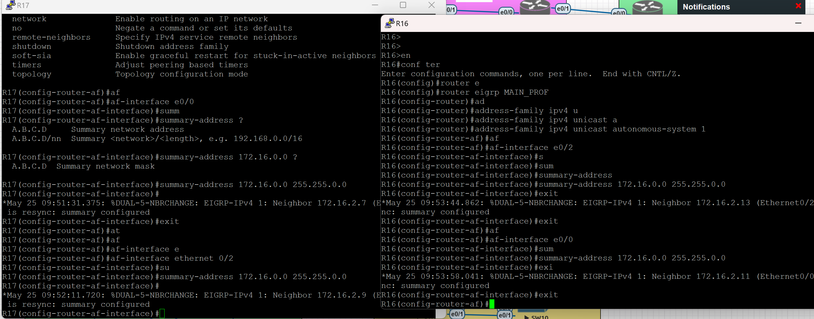
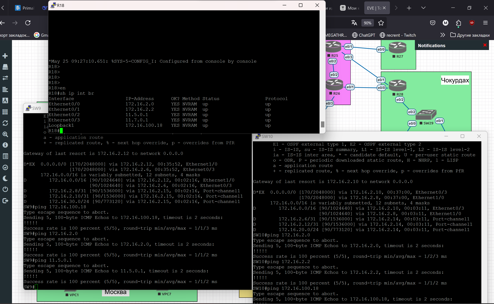
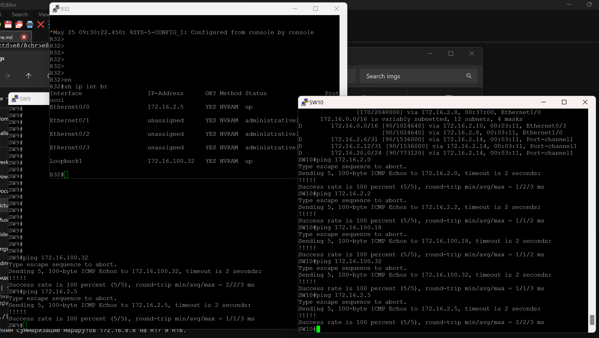
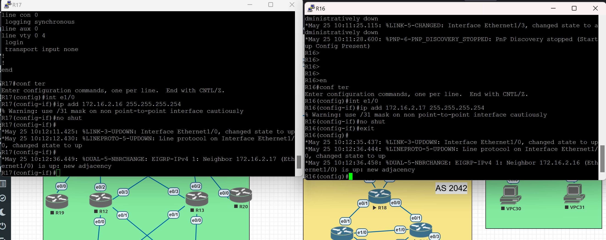
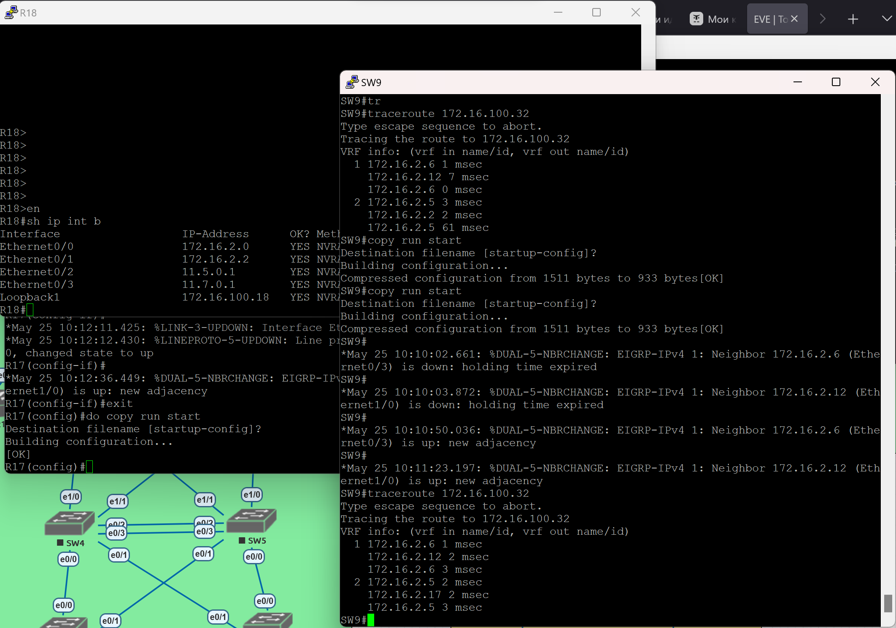

#  Лабораторная работа. EIGRP

###  Цели

 + Часть 1. В офисе С.-Петербург настроить EIGRP.
 + Часть 2. R32 получает только маршрут по умолчанию.
 + Часть 3. R16-17 анонсируют только суммарные префиксы.
 + Часть 4. Использовать EIGRP named-mode для настройки сети.

### Топология:

### Таблица адресации:

<table><thead>
  <tr>
    <th>AS</th>
    <th>Device</th>
    <th>Interface</th>
    <th>IPv4 Address</th>
  </tr></thead>
<tbody>
  <tr>
    <td rowspan="10">AS1001</td>
    <td>R14</td>
    <td>e0/0 e0/1 e0/2 e0/3 lo1 e1/0</td>
    <td>192.168.2.5/30 192.168.2.9/30 11.0.0.0/31 192.168.101.1/31 192.168.100.14/32 192.168.2.45/30</td>
  </tr>
  <tr>
    <td>R12</td>
    <td>e0/0 e0/1 e0/2 e0/3 lo1</td>
    <td>192.168.2.25/30 192.168.2.29/30 192.168.2.6/30 192.168.2.13/30 192.168.100.12/32</td>
  </tr>
  <tr>
    <td>R19</td>
    <td>e0/0 lo1</td>
    <td>192.168.101.0/31 192.168.100.19/32</td>
  </tr>
  <tr>
    <td>R13</td>
    <td>e0/0 e0/1 e0/2 e0/3 lo1</td>
    <td>192.168.2.33/30 192.168.2.37/30 192.168.2.22/30 192.168.2.10/30 192.168.100.13/32</td>
  </tr>
  <tr>
    <td>R15</td>
    <td>e0/0 e0/1 e0/2 e0/3 lo1 e1/0</td>
    <td>192.168.2.21/30 192.168.2.14/30 11.1.0.0/31 192.168.2.17/30 192.168.100.15/32 192.168.2.46</td>
  </tr>
  <tr>
    <td>R20</td>
    <td>e0/0 lo1</td>
    <td>192.168.2.18/30 192.168.100.20/32</td>
  </tr>
  <tr>
    <td>SW4</td>
    <td>e1/0 e1/1 po1 int vlan 10 mng int vlan 20 vpc vlan</td>
    <td>192.168.2.26/30 192.168.2.38/30 192.168.2.41/30 192.168.10.1/24 192.168.20.1/24</td>
  </tr>
  <tr>
    <td>SW5</td>
    <td>e1/1 e1/0 po1 int vlan 10 mng int vlan 20 vpc vlan</td>
    <td>192.168.2.30/30 192.168.2.34/30 192.168.2.42/30 192.168.10.2/24 192.168.20.2/24</td>
  </tr>
  <tr>
    <td>SW3</td>
    <td>svi vlan 10</td>
    <td>192.168.10.11/24</td>
  </tr>
  <tr>
    <td>SW2</td>
    <td>svi vlan 10</td>
    <td>192.168.10.10/24</td>
  </tr>
  <tr>
    <td>AS101</td>
    <td>R22</td>
    <td>e0/0 e0/1 e0/2 lo1</td>
    <td>11.0.0.1/31 11.2.0.0/31 11.3.0.0/31 11.0.100.22/32</td>
  </tr>
  <tr>
    <td>AS301</td>
    <td>R21</td>
    <td>e0/0 e0/1 e0/2 lo1</td>
    <td>11.1.0.1/31 11.2.0.1/31 11.4.0.0/31 11.0.100.21/32</td>
  </tr>
  <tr>
    <td rowspan="4">AS520</td>
    <td>R23</td>
    <td>e0/0 e0/1 e0/2 lo1</td>
    <td>11.3.0.1/31 10.0.0.0/31 10.0.0.2/31 10.0.100.23/32</td>
  </tr>
  <tr>
    <td>R24</td>
    <td>e0/0 e0/1 e0/2 e0/3 lo1</td>
    <td>11.4.0.1/31 10.0.0.4/31 10.0.0.3/31 11.5.0.0/31 10.0.100.24/32</td>
  </tr>
  <tr>
    <td>R25</td>
    <td>e0/0 e0/1 e0/2 e0/3 lo1</td>
    <td>10.0.0.1/31 11.6.0.0/31 10.0.0.6/31 11.8.0.0/31 10.0.100.25/32</td>
  </tr>
  <tr>
    <td>R26</td>
    <td>e0/0 e0/1 e0/2 e0/3 lo1</td>
    <td>10.0.0.5/31 11.9.0.0/31 10.0.0.7/31 11.7.0.0/31 10.0.100.26/32</td>
  </tr>
  <tr>
    <td>Лабытнанги</td>
    <td>R27</td>
    <td>e0/0 lo1</td>
    <td>11.6.0.1/31 20.0.100.27/32</td>
  </tr>
  <tr>
    <td rowspan="2">Чокурдах</td>
    <td>R28</td>
    <td>e0/0 e0/1 lo1 e0/2.10 mng vlan e0/2.20 vpc vlan</td>
    <td>11.9.0.1/31 11.8.0.1/31 172.31.100.28/32 172.31.10.1/24 172.31.20.1/24</td>
  </tr>
  <tr>
    <td>SW29</td>
    <td>SVI 10</td>
    <td>172.31.10.10/24</td>
  </tr>
  <tr>
    <td rowspan="6">AS2042</td>
    <td>R18</td>
    <td>e0/0 e0/1 e0/2 e0/3 lo1</td>
    <td>172.16.2.0/31 172.16.2.2/31 11.5.0.1/31 11.7.0.1/31 172.16.100.18/32</td>
  </tr>
  <tr>
    <td>R17</td>
    <td>e0/0 e0/1 e0/2 lo1 e1/0</td>
    <td>172.16.2.6/31 172.16.2.3/31 172.16.2.8/31 172.16.100.17/32 172.16.2.16/31</td>
  </tr>
  <tr>
    <td>R16</td>
    <td>e0/0 e0/1 e0/2 e0/3 lo1 e1/0</td>
    <td>172.16.2.10/31 172.16.2.1/31 172.16.2.12/31 172.16.2.4/31 172.16.100.16/32 172.16.2.17/31</td>
  </tr>
  <tr>
    <td>R32</td>
    <td>e0/0 lo1</td>
    <td>172.16.2.5/31 172.16.100.32/32</td>
  </tr>
  <tr>
    <td>SW9</td>
    <td>e0/1 e0/3 svi vlan 20 vpc vlan po1</td>
    <td>172.16.2.13/31 172.16.2.7/31 172.16.20.1/24 172.16.2.14/31</td>
  </tr>
  <tr>
    <td>SW10</td>
    <td>e0/1 e0/3 svi vlan 30 vpc vlan po1</td>
    <td>172.16.2.9/31 172.16.2.11/31 172.16.30.1/24 172.16.2.15/31</td>
  </tr>
</tbody></table>

### ДЗ:

Включим EIGRP на маршуртизаторах R18 и R17. Аналогично сделаем на остальных устройствах. (тут ошибка именования инстансов eigrp, дальше исправил)

Проверим соседство на роутерах.

Настроим маршруты по умолчанию на R18 и сделаем редистрибьюцию статических маршрутов.

На R16 создаим префикс лист DEFAULT_ONLY, который разрешает только 0.0.0.0/0 маршрут.
Выполним distribute-list prefix DEFAULT_ONLY out Ethernet0/3 ,чтобы отдавать соседу только маршрут по умолчанию.
Проверим на R32, что получаем только 0.0.0.0 маршрут.

Выполним суммаризацию маршрутов 172.16.0.0 на R17 и R16.

Проверим таблицу маршрутизации на л3 свичах.

Пропингуем R32 со свичей 

Иногда, трафик от свичей л3 мог идти через R18. Эт не ок и по этой причине добавим линк между R16 и R17.
Сравним таблице traceroute.

