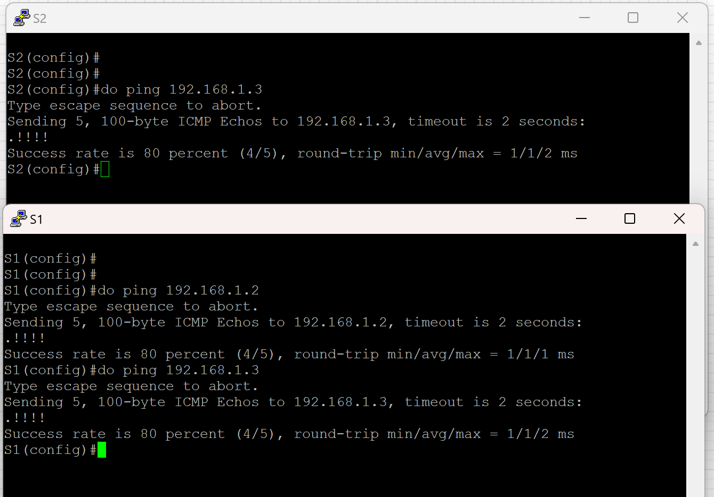
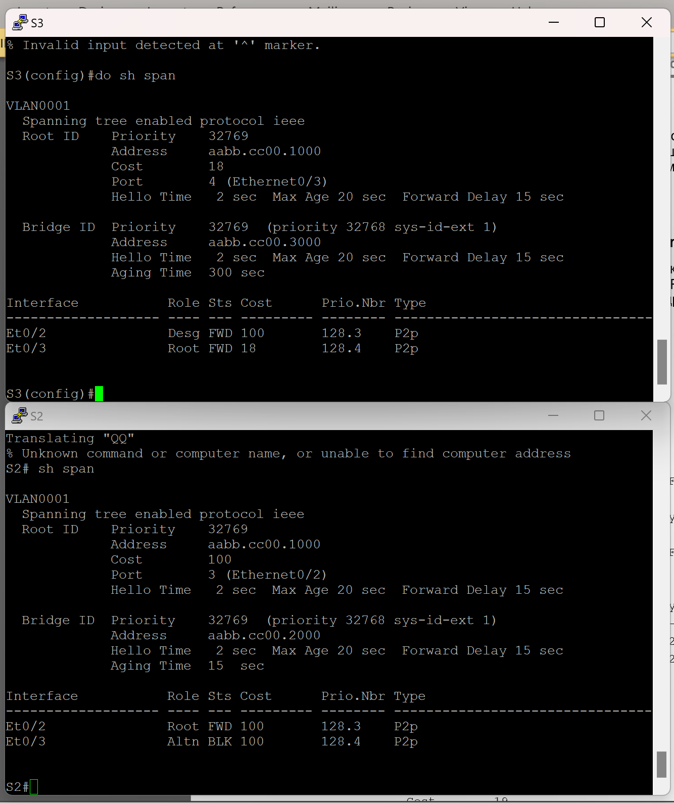

#  Лабораторная работа. Развертывание коммутируемой сети с резервными каналами

###  Цели
+ Часть 1. Создание сети и настройка основных параметров устройства
+ Часть 2. Выбор корневого моста
+ Часть 3. Наблюдение за процессом выбора протоколом STP порта, исходя из стоимости портов
+ Часть 4. Наблюдение за процессом выбора протоколом STP порта, исходя из приоритета портов

### Топология:

### Таблица адресации:

<table>

<tr>
	<td>Device</td>
	<td>Interface/vlan</td>
	<td>IP address</td>
	<td>Subnet mask</td>
</tr>

<tr>
        <td>S1</td>
        <td>VLAN 1</td>
	  <td>192.168.1.1</td>
	  <td>255.255.255.0</td>
</tr>

<tr>
	  <td>S2</td>
        <td>VLAN 1</td>
	  <td>192.168.1.2</td>
	  <td>255.255.255.0</td>
</tr>

<tr>
        <td>S3</td>
        <td>VLAN 1</td>
	  <td>192.168.1.3</td>
	  <td>255.255.255.0</td>
</tr>

</table>

Домашнее задание: 

Выполним настройку коммутатора S2, аналогично настроим остальные устройства

Пропингуем устройства 

Выключим все порты на коммутаторах 

Настроим транк порты 

Включим необходимые порты 

Проверим статус STP

С учетом выходных данных, поступающих с коммутаторов, ответьте на следующие вопросы.
Какой коммутатор является корневым мостом? ____S1____
Почему этот коммутатор был выбран протоколом spanning-tree в качестве корневого моста?
______Тк у него самое малое значение мак адреса___________________________
_______________________________________________________________________________________
Какие порты на коммутаторе являются корневыми портами? ___Подключение которых ведет к корневому коммутатору_______________
Какие порты на коммутаторе являются назначенными портами? ___Которые ялвяются самый коротким путем до рут коммутатора_________
Какой порт отображается в качестве альтернативного и в настоящее время заблокирован? ___E0/2 на S3__________
Почему протокол spanning-tree выбрал этот порт в качестве невыделенного (заблокированного) порта?
___Потому что BPDU S3 коммутатора оказалась хуже, чем у S2. Другой порт не заблокировался тк он смотрит на рут коммутатор____________________

Изменим стоимость порта 

Теперь на S2 порт E0/3 является altr 

Почему протокол spanning-tree заменяет ранее заблокированный порт на назначенный порт и блокирует порт, который был назначенным портом на другом коммутаторе?

Потому что у S3 стоимость пути до корневого коммутатора стала меньше, чем у S2

Отменим цену порта и проверим, что порт снова заблокирован 

Включим все порты 

Проверим статус STP

Какой порт выбран протоколом STP в качестве порта корневого моста на каждом коммутаторе некорневого моста? __S2:e0/1 S3:e0/0______________
Почему протокол STP выбрал эти порты в качестве портов корневого моста на этих коммутаторах?________S2:e0/0 те у e0/2 выше приоритет порта______S3:e0/0 тк самый низкий приоритет порта из всех_____

