#  Лабораторная работа. iBGP

###  Цели

+ Настроите iBGP в офисом Москва между маршрутизаторами R14 и R15.
+ Настроите iBGP в провайдере Триада, с использованием RR.
+ Настройте офиса Москва так, чтобы приоритетным провайдером стал Ламас.
+ Настройте офиса С.-Петербург так, чтобы трафик до любого офиса распределялся по двум линкам одновременно.
+ Все сети в лабораторной работе должны иметь IP связность.
+ План работы и изменения зафиксированы в документации.

### Топология:

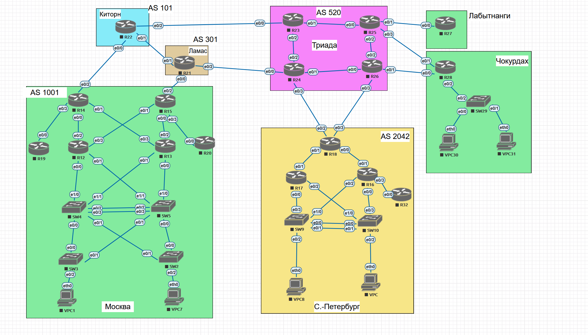

### Таблица адресации:

<table><thead>
  <tr>
    <th>AS</th>
    <th>Device</th>
    <th>Interface</th>
    <th>IPv4 Address</th>
  </tr></thead>
<tbody>
  <tr>
    <td rowspan="10">AS1001</td>
    <td>R14</td>
    <td>e0/0 e0/1 e0/2 e0/3 lo1 e1/0</td>
    <td>192.168.2.5/30 192.168.2.9/30 11.0.0.0/31 192.168.101.1/31 192.168.100.14/32 192.168.2.45/30</td>
  </tr>
  <tr>
    <td>R12</td>
    <td>e0/0 e0/1 e0/2 e0/3 lo1</td>
    <td>192.168.2.25/30 192.168.2.29/30 192.168.2.6/30 192.168.2.13/30 192.168.100.12/32</td>
  </tr>
  <tr>
    <td>R19</td>
    <td>e0/0 lo1</td>
    <td>192.168.101.0/31 192.168.100.19/32</td>
  </tr>
  <tr>
    <td>R13</td>
    <td>e0/0 e0/1 e0/2 e0/3 lo1</td>
    <td>192.168.2.33/30 192.168.2.37/30 192.168.2.22/30 192.168.2.10/30 192.168.100.13/32</td>
  </tr>
  <tr>
    <td>R15</td>
    <td>e0/0 e0/1 e0/2 e0/3 lo1 e1/0</td>
    <td>192.168.2.21/30 192.168.2.14/30 11.1.0.0/31 192.168.2.17/30 192.168.100.15/32 192.168.2.46</td>
  </tr>
  <tr>
    <td>R20</td>
    <td>e0/0 lo1</td>
    <td>192.168.2.18/30 192.168.100.20/32</td>
  </tr>
  <tr>
    <td>SW4</td>
    <td>e1/0 e1/1 po1 int vlan 10 mng int vlan 20 vpc vlan</td>
    <td>192.168.2.26/30 192.168.2.38/30 192.168.2.41/30 192.168.10.1/24 192.168.20.1/24</td>
  </tr>
  <tr>
    <td>SW5</td>
    <td>e1/1 e1/0 po1 int vlan 10 mng int vlan 20 vpc vlan</td>
    <td>192.168.2.30/30 192.168.2.34/30 192.168.2.42/30 192.168.10.2/24 192.168.20.2/24</td>
  </tr>
  <tr>
    <td>SW3</td>
    <td>svi vlan 10</td>
    <td>192.168.10.11/24</td>
  </tr>
  <tr>
    <td>SW2</td>
    <td>svi vlan 10</td>
    <td>192.168.10.10/24</td>
  </tr>
  <tr>
    <td>AS101</td>
    <td>R22</td>
    <td>e0/0 e0/1 e0/2 lo1</td>
    <td>11.0.0.1/31 11.2.0.0/31 11.3.0.0/31 11.0.100.22/32</td>
  </tr>
  <tr>
    <td>AS301</td>
    <td>R21</td>
    <td>e0/0 e0/1 e0/2 lo1</td>
    <td>11.1.0.1/31 11.2.0.1/31 11.4.0.0/31 11.0.100.21/32</td>
  </tr>
  <tr>
    <td rowspan="4">AS520</td>
    <td>R23</td>
    <td>e0/0 e0/1 e0/2 lo1</td>
    <td>11.3.0.1/31 10.0.0.0/31 10.0.0.2/31 10.0.100.23/32</td>
  </tr>
  <tr>
    <td>R24</td>
    <td>e0/0 e0/1 e0/2 e0/3 lo1</td>
    <td>11.4.0.1/31 10.0.0.4/31 10.0.0.3/31 11.5.0.0/31 10.0.100.24/32</td>
  </tr>
  <tr>
    <td>R25</td>
    <td>e0/0 e0/1 e0/2 e0/3 lo1</td>
    <td>10.0.0.1/31 11.6.0.0/31 10.0.0.6/31 11.8.0.0/31 10.0.100.25/32</td>
  </tr>
  <tr>
    <td>R26</td>
    <td>e0/0 e0/1 e0/2 e0/3 lo1</td>
    <td>10.0.0.5/31 11.9.0.0/31 10.0.0.7/31 11.7.0.0/31 10.0.100.26/32</td>
  </tr>
  <tr>
    <td>Лабытнанги</td>
    <td>R27</td>
    <td>e0/0 lo1</td>
    <td>11.6.0.1/31 20.0.100.27/32</td>
  </tr>
  <tr>
    <td rowspan="2">Чокурдах</td>
    <td>R28</td>
    <td>e0/0 e0/1 lo1 e0/2.10 mng vlan e0/2.20 vpc vlan</td>
    <td>11.9.0.1/31 11.8.0.1/31 172.31.100.28/32 172.31.10.1/24 172.31.20.1/24</td>
  </tr>
  <tr>
    <td>SW29</td>
    <td>SVI 10</td>
    <td>172.31.10.10/24</td>
  </tr>
  <tr>
    <td rowspan="6">AS2042</td>
    <td>R18</td>
    <td>e0/0 e0/1 e0/2 e0/3 lo1</td>
    <td>172.16.2.0/31 172.16.2.2/31 11.5.0.1/31 11.7.0.1/31 172.16.100.18/32</td>
  </tr>
  <tr>
    <td>R17</td>
    <td>e0/0 e0/1 e0/2 lo1 e1/0</td>
    <td>172.16.2.6/31 172.16.2.3/31 172.16.2.8/31 172.16.100.17/32 172.16.2.16/31</td>
  </tr>
  <tr>
    <td>R16</td>
    <td>e0/0 e0/1 e0/2 e0/3 lo1 e1/0</td>
    <td>172.16.2.10/31 172.16.2.1/31 172.16.2.12/31 172.16.2.4/31 172.16.100.16/32 172.16.2.17/31</td>
  </tr>
  <tr>
    <td>R32</td>
    <td>e0/0 lo1</td>
    <td>172.16.2.5/31 172.16.100.32/32</td>
  </tr>
  <tr>
    <td>SW9</td>
    <td>e0/1 e0/3 svi vlan 20 vpc vlan po1</td>
    <td>172.16.2.13/31 172.16.2.7/31 172.16.20.1/24 172.16.2.14/31</td>
  </tr>
  <tr>
    <td>SW10</td>
    <td>e0/1 e0/3 svi vlan 30 vpc vlan po1</td>
    <td>172.16.2.9/31 172.16.2.11/31 172.16.30.1/24 172.16.2.15/31</td>
  </tr>
</tbody></table>

### ДЗ:

Настроим iBGP между R14 и R15 и проверим таблицу соседей

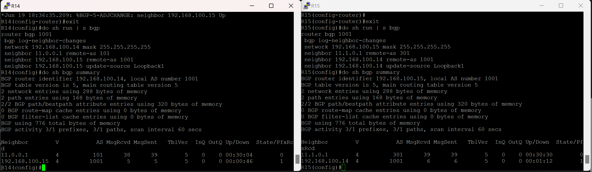

Настроим на R24 peer-grooup CLIENTS, поделючим ее к AS 520, сделаем подключение из под lo1, сделаем ее RR server и сделаем так, чтобы он слушал подключения от клиентов
из сети 10.0.0.0/16 

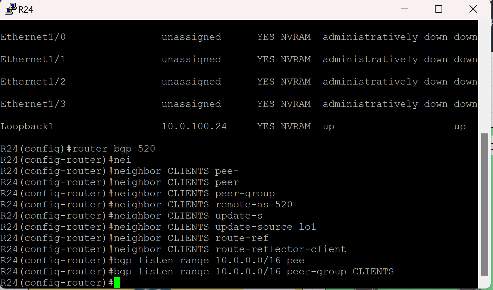  

Подключим по iBPG R23 к нашему RR server. Тк is-is на lo's не был включен - соседство не поднимется.
Включим на всех роутерах в AS 520 is-is на lo's и увидим, что соседство поднимется.

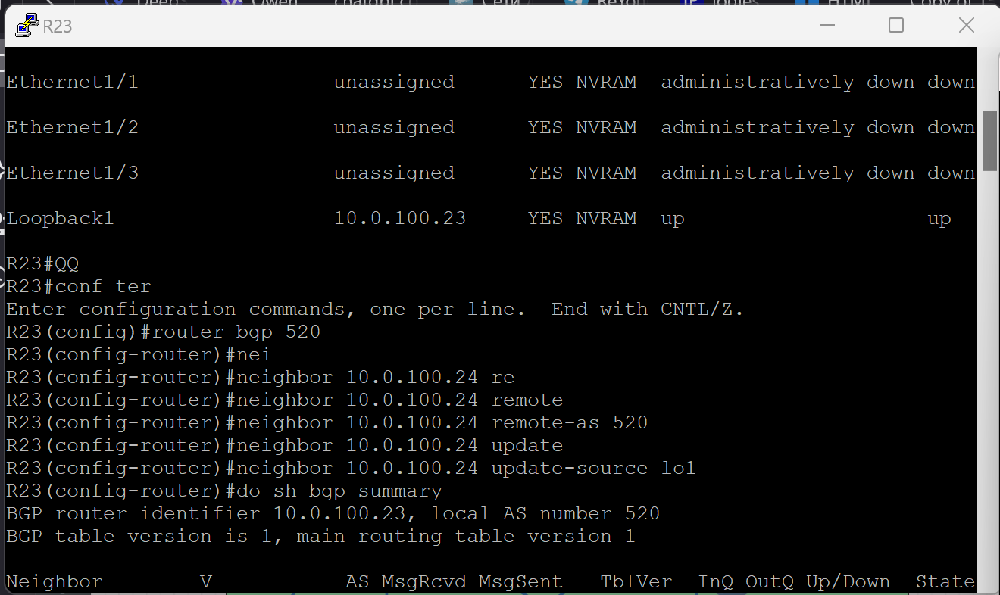
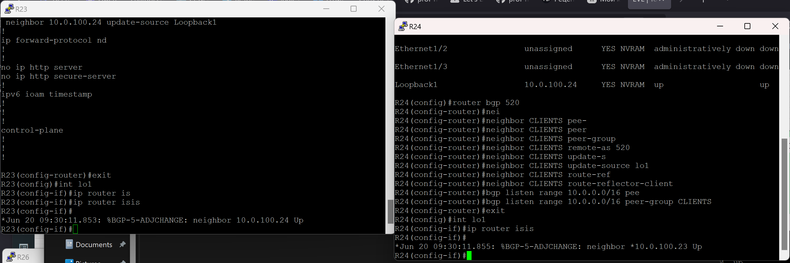
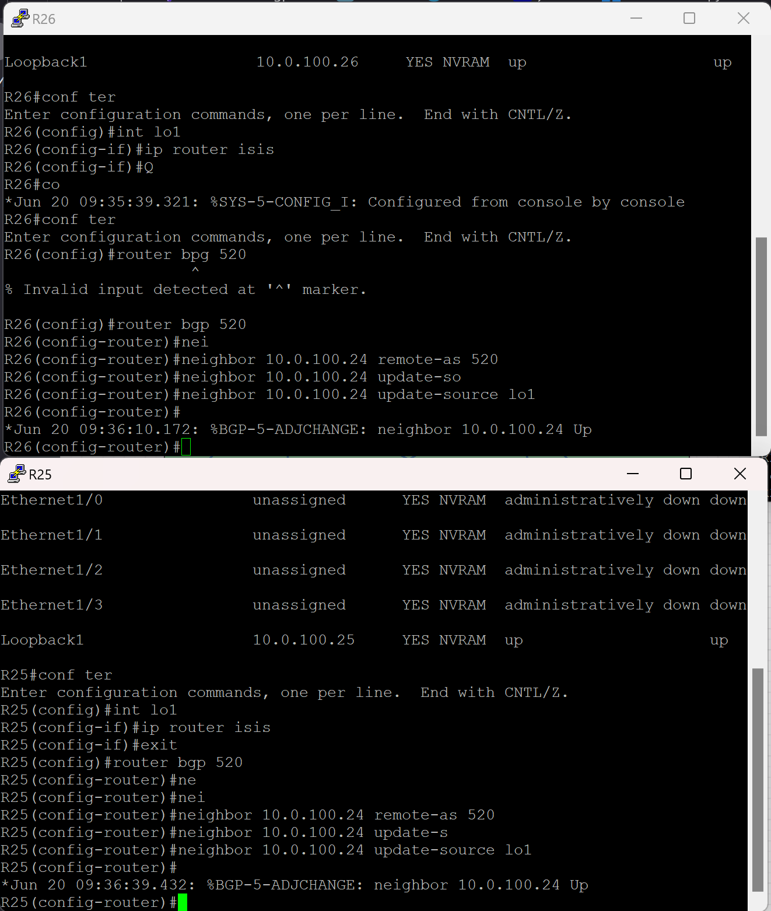

Чтобы R15 и R14 ходили через R21 настроим route-map с изменением local-preference на соседа.

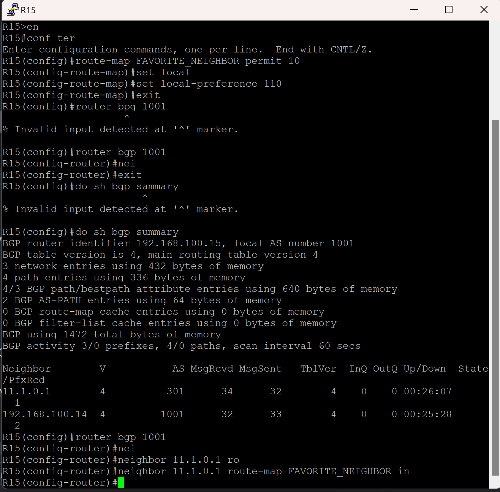

Чтобы R14 тоже мог ходить через R22 сделаем на R15 next-hop-self (R14 не знает про 11.1.0.1)

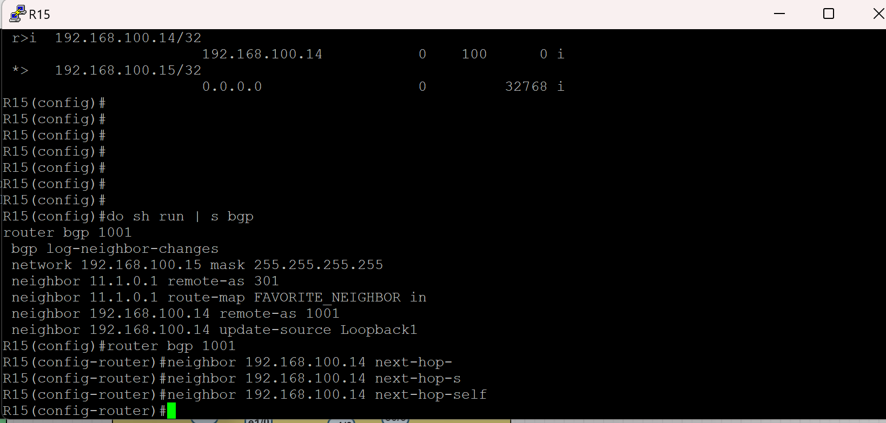

Проверим таблцы bgp

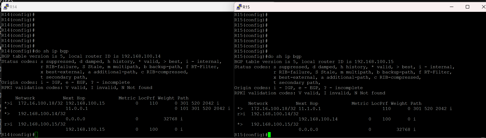

Чтобы R18 имел маршруты до неизвестных сетей мы включим next-hop-self на RR server R24.

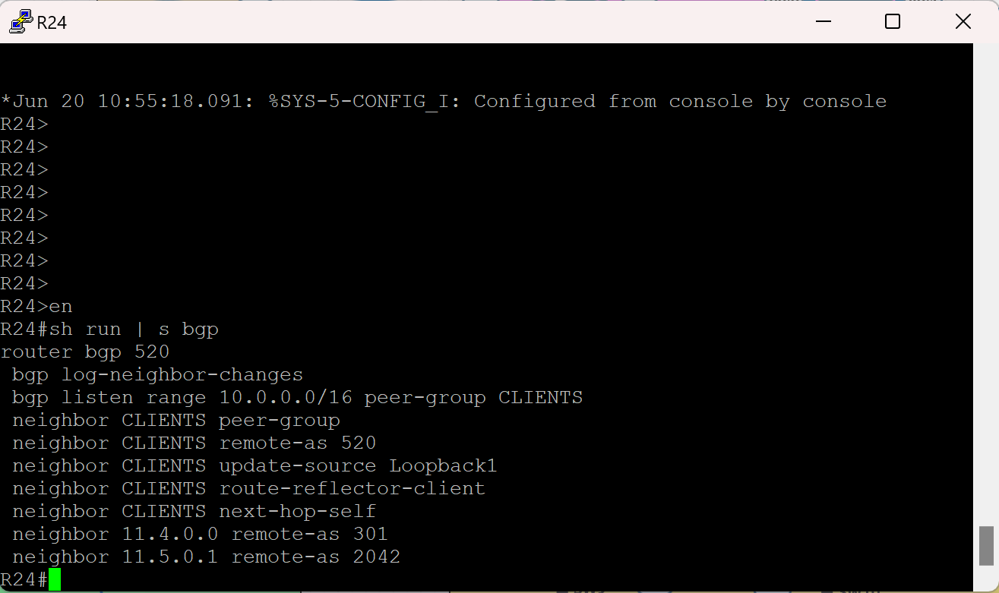

Сделаем соседство eBGP между R26 и R18 (11.7.0.0 и 11.7.0.1)

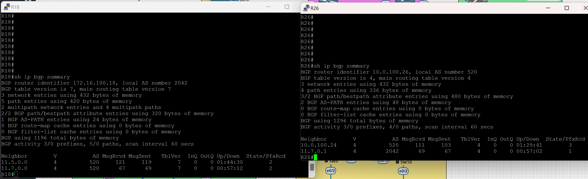

Проверим таблицу bgp на R18, что он видит next-hops через оба устройства 

Теперь нужно включить балансировку bgp (maximum-paths 2) на R18

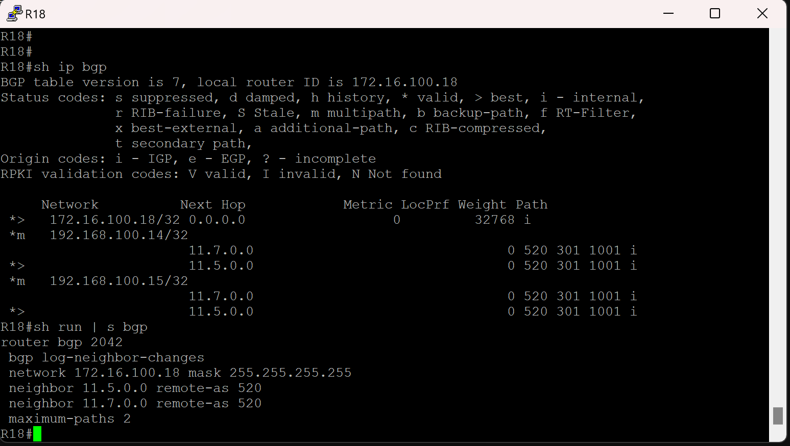

Делаем трассировку до R14 и R15 и видим, что трассировка работает

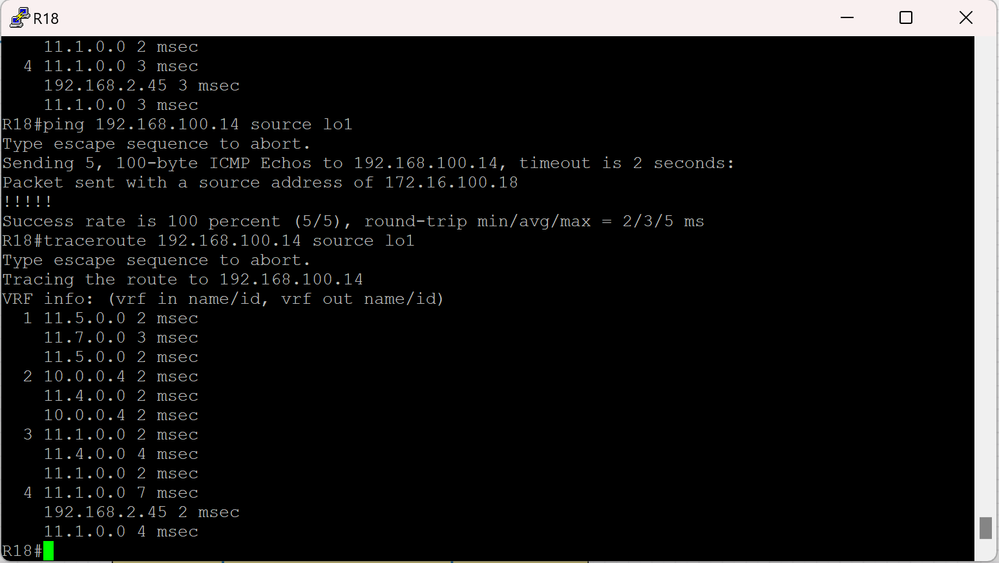
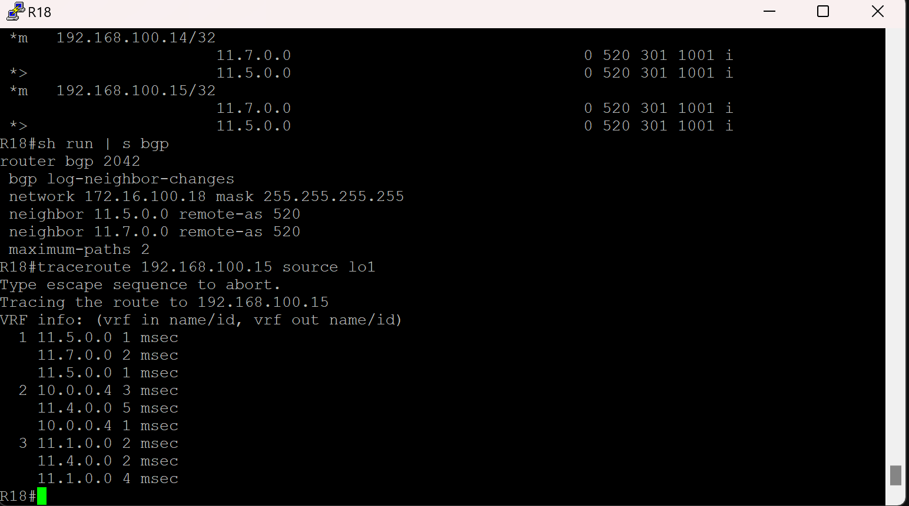
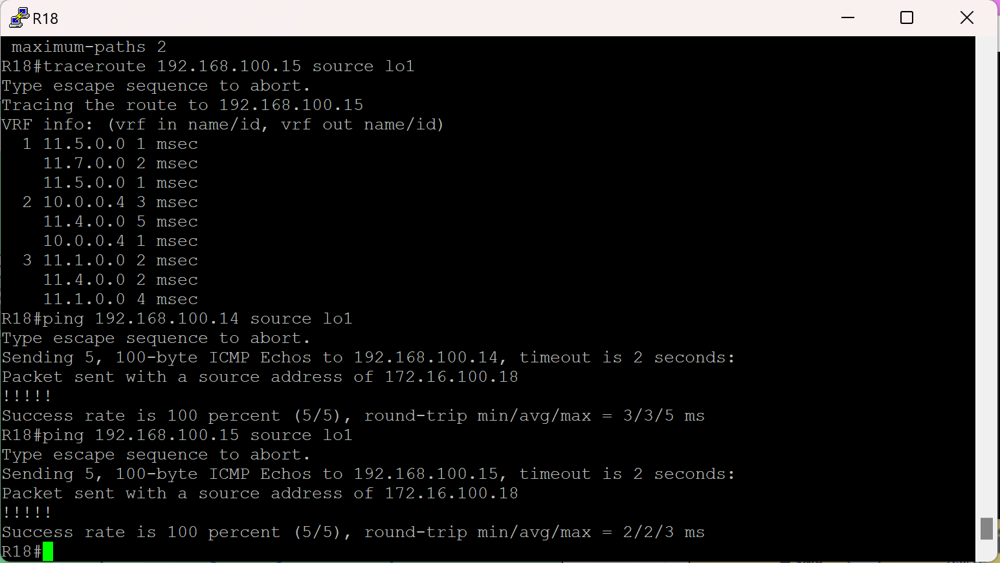

