#  Lab - Configure Router-on-a-Stick Inter-VLAN Routing

###  Objectives
+ Part 1: Build the Network and Configure Basic Device Settings
+ Part 2: Create VLANs and Assign Switch Ports
+ Part 3: Configure an 802.1Q Trunk between the Switches
+ Part 4: Configure Inter-VLAN Routing on the Router
+ Part 5: Verify Inter-VLAN Routing is working

### Топология:

### Addressing Table:

<table>

<tr>
	<td>Device</td>
	<td>Interface/vlan</td>
	<td>IP address</td>
	<td>Subnet mask</td>
	<td>Default gateway</td>
</tr>

<tr>
        <td>R1</td>
        <td>E0/1.3</td>
	  <td>192.168.3.1</td>
	  <td>255.255.255.0</td>
	  <td rowspan="3">N/A</td>
</tr>

<tr>
	  <td></td>
        <td>E0/1.4</td>
	  <td>192.168.4.1</td>
	  <td>255.255.255.0</td>
</tr>

<tr>
        <td></td>
        <td>E0/1.8</td>
	  <td>N/A</td>
	  <td>N/A</td>
</tr>

<tr>
        <td>S1</td>
        <td>VLAN 3</td>
	  <td>192.168.3.11</td>
	  <td>255.255.255.0</td>
	  <td>192.168.3.1</td>
</tr>

<tr>
        <td>S2</td>
        <td>VLAN 3</td>
	  <td>192.168.3.12</td>
	  <td>255.255.255.0</td>
	  <td>192.168.3.1</td>
</tr>

<tr>
        <td>PC A</td>
        <td>NIC</td>
	  <td>192.168.3.3</td>
	  <td>255.255.255.0</td>
	  <td>192.168.3.1</td>
</tr>

<tr>
        <td>PC B</td>
        <td>NIC</td>
	  <td>192.168.4.3</td>
	  <td>255.255.255.0</td>
	  <td>192.168.4.1</td>
</tr>

</table>

### VLAN Table:

<table>

<tr>
	<td>VLAN</td>
	<td>Name</td>
	<td>Interface</td>
</tr>

<tr>
        <td>3</td>
        <td>Mng</td>
	  <td>S1: VLAN 3 S2: VLAN 3  S1:E0/1</td>
</tr>

<tr>
        <td>4</td>
        <td>Operations</td>
	  <td>S2: E0/0</td>
</tr>

<tr>
        <td>7</td>
        <td>ParkingLot</td>
	  <td>All other</td>
</tr>

<tr>
        <td>8</td>
        <td>Native</td>
	  <td>N/A</td>
</tr>

</table>

### Домашнее задание:

Выполним базовую настройку роутера 

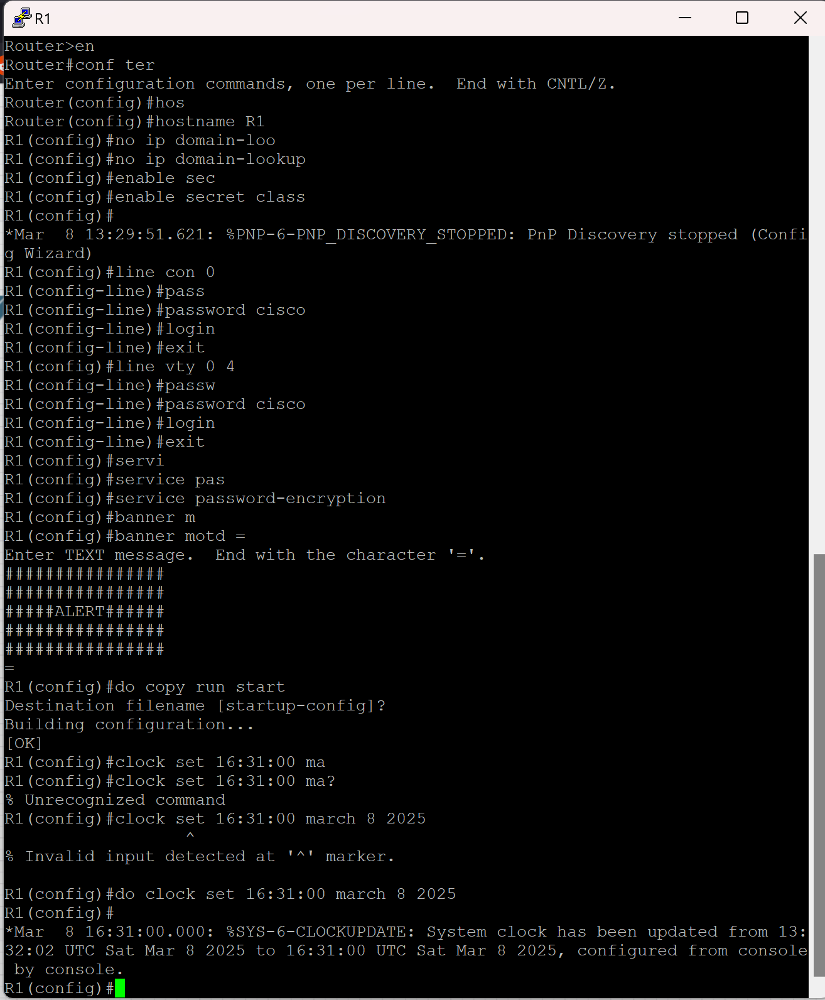

Базово настоим свитчи, аналогично с S2

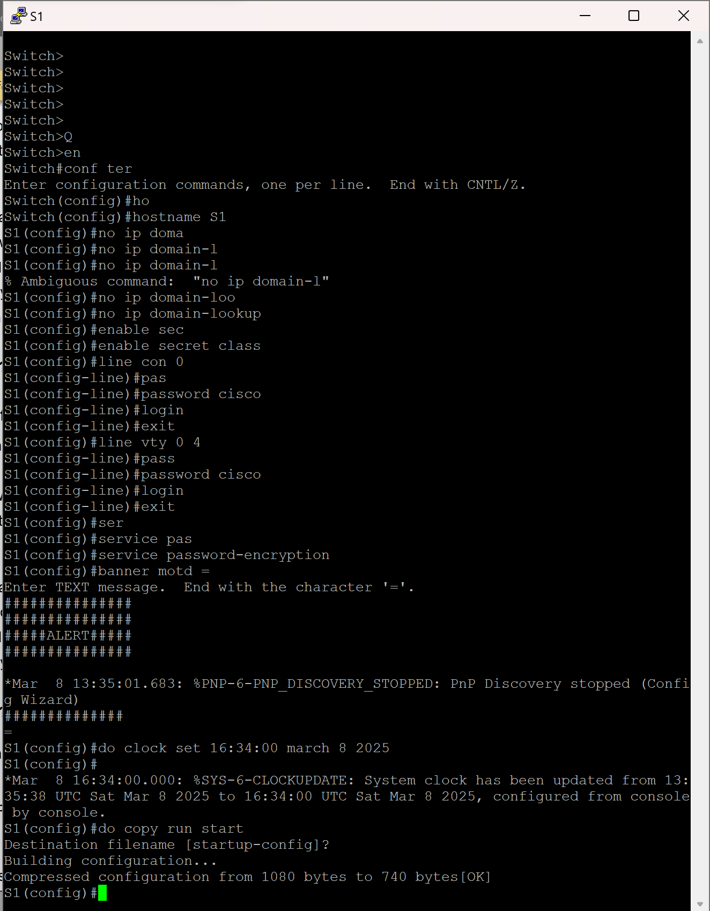

Настроим адресацию на компьютерах

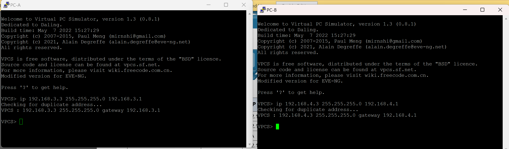

Создадим вланы на свичах

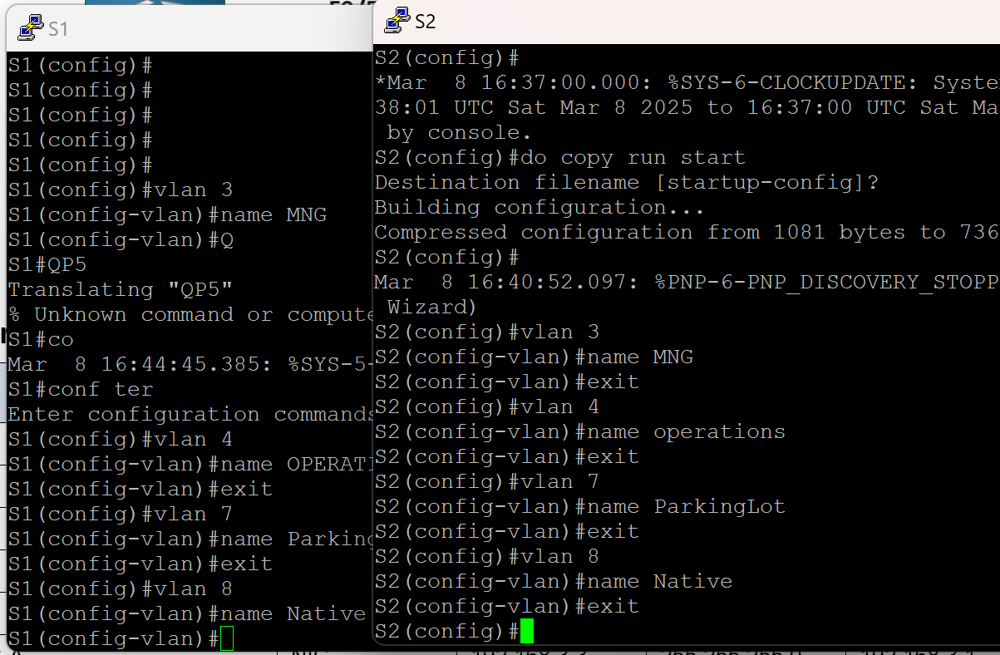

Настроим SVI интерфейсы и маршрут по умолчанию на свичах

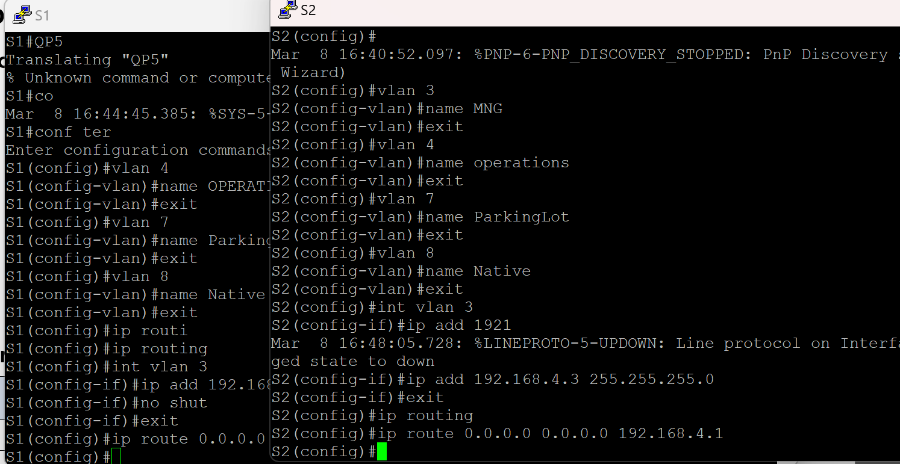

Перенесем неиспользуемые порты в 7ой влан и выключим их

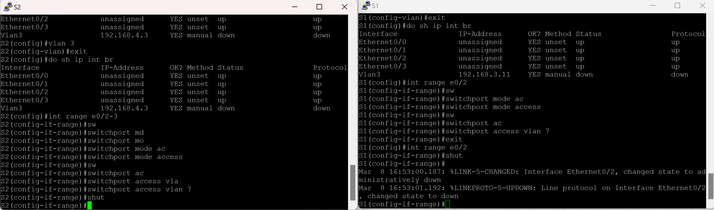

Переведем соотв порты в соотв вланы

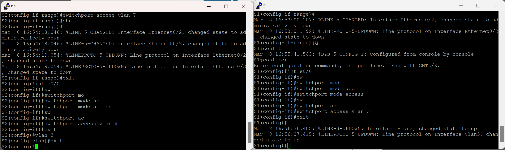
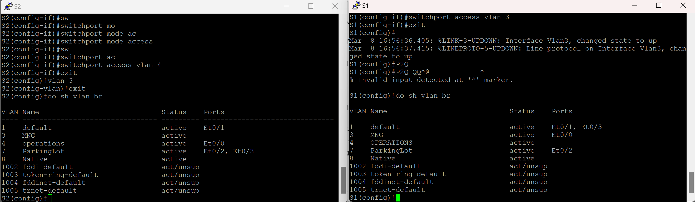

Настроим транк между свичами и установим нативный влан

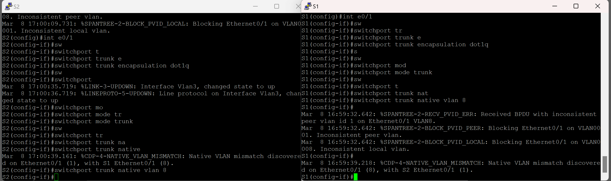

Разрешим ходить по транку только опред. вланам

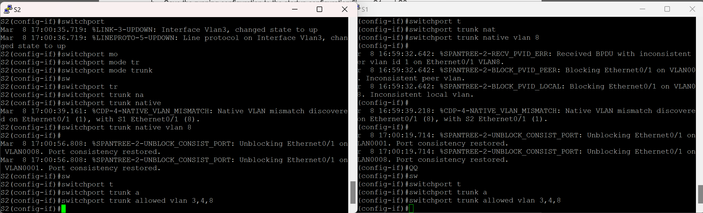
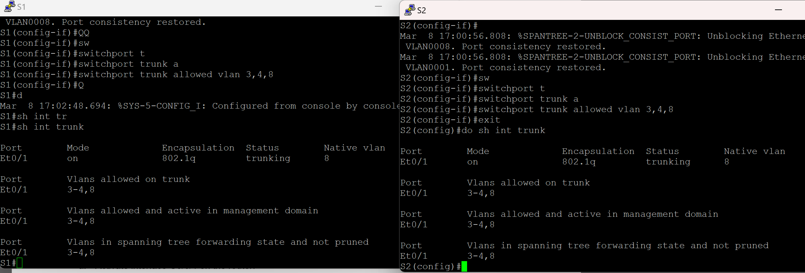

Настроим транк к роутеру на S1

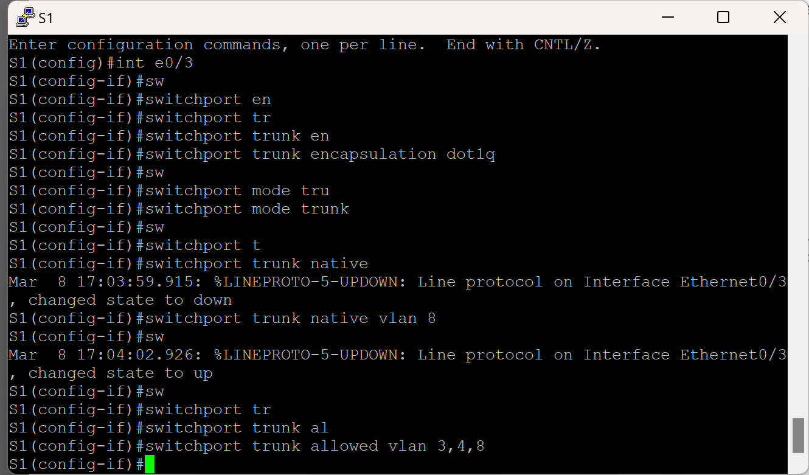
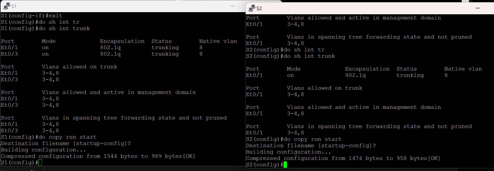

Настроим саб интерфейсы на R1

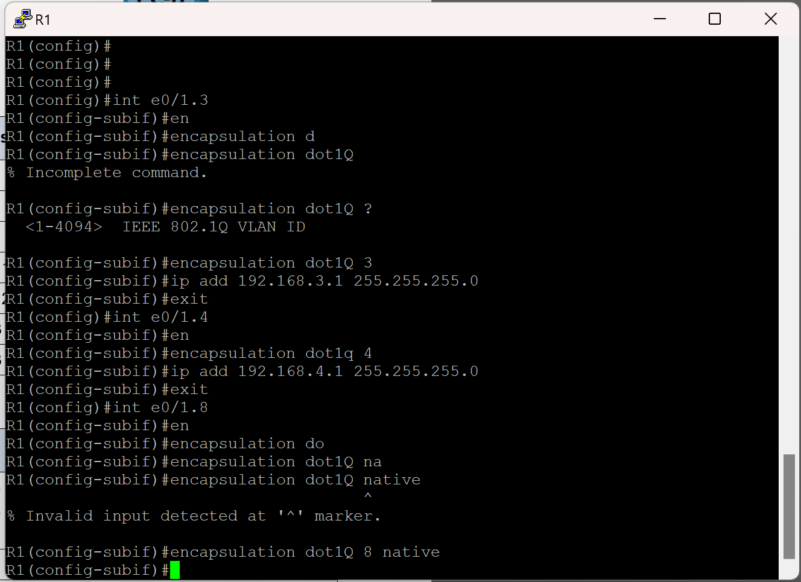

Пропингуем все устройства 

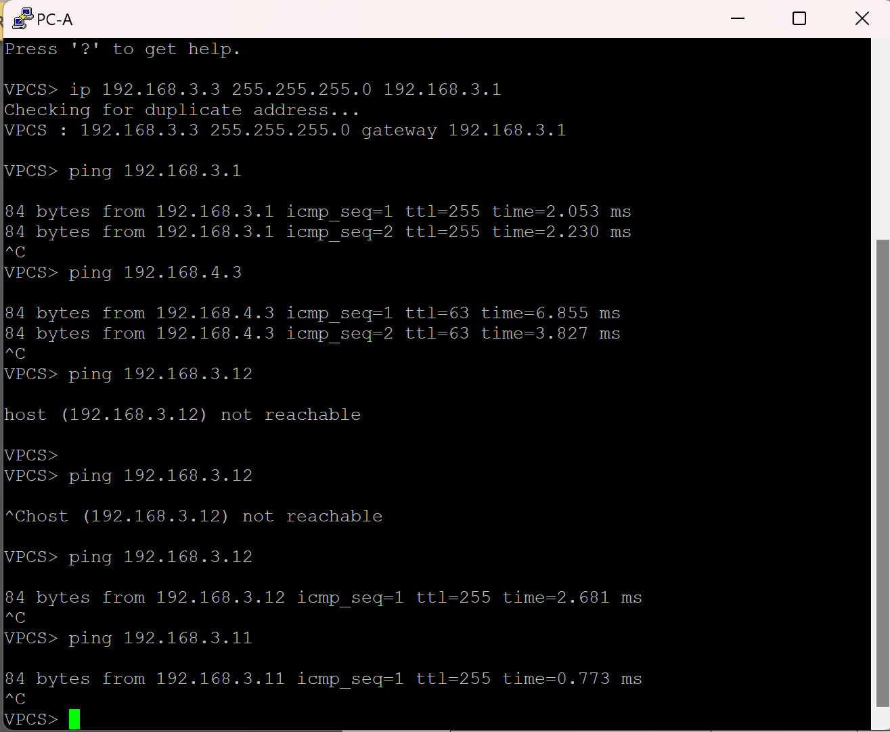

From the command prompt on PC-B, issue the tracert command to the address of PC-A.

Question:
What intermediate IP addresses are shown in the results?

Answer: 

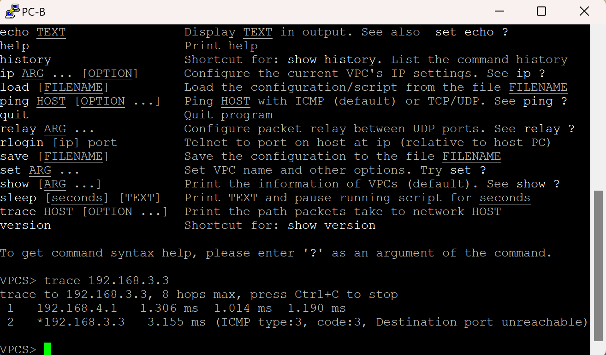

Отображается адрес саб интерфейса роутера, те гейтвея для этого влана и конечный адрес компьютера, который  мы пингуем